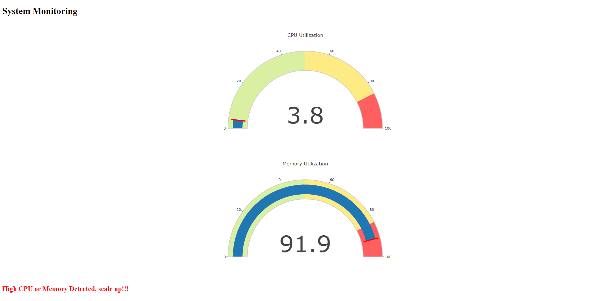

<h1 align="center">Welcome to cloud-native-resource-monitor👋</h1>

# 📝 Overview
<p align="center">
  <a href="" rel="noopener">
 </a>
</p>
Welcome to the complete Cloud Native Resource Monitoring application. This Python application built with Flask can monitor the CPU and Memory utilization in real time. This project embraces containerisation using Docker and orchestration using Kubernetes ensuring ease of deployment and scalability.

## ⚙️ Prerequisites
- Flask >= 2.2.3
- psutil >= 5.8.0
- kubectl >= 1.28
- plotly >= 5.5.0
- boto3 >= 1.9.148
- kubernetes >= 10.0.1

# 👨🏽‍💻 Getting Started
Follow these steps to set up and deploy the Real-Time Cloud Native Resource Monitoring application

## Part 1: Creating and Deploying the Flask application locally

### Step 1: Create Python Monitoring App with Flask
Start by creating a Python monitoring application using Flask. Make sure you have Python and Flask installed on your machine. Best practise is to follow the Flask documentation for the same.

### Step 2: Run the App Locally on Port 5000
Navigate to your app's root directory and run:
```bash
python3 app.py
```
This will deploy your app on the localhost, you can access it at http://localhost:5000 in your web browser.

## Part 2: Dockerizing the Flask Application
To containerize the Flask application, you need to create a Dockerfile. A Dockerfile is a text document that contains all the commands a user could call on the command line to assemble an image.

### Step 1: Create a **`Dockerfile`** in the root directory of the project
A Dockerfile is simply a text-based file with no file extension that contains a script of instructions. Docker uses this script to build a container image. Refer the Docker documentation to create a docker file as per your own requirements. Here's a sample Dockerfile:

```docker
# Use an official Node.js runtime as a base image
FROM python:3.9-slim-buster

# Set the working directory in the container
WORKDIR /usr/src/app

# Copy requirements file to the working directory
COPY requirements.txt .

# Install the application dependencies
RUN pip install -r requirements.txt

# Copy the application files to the working directory
COPY . .

# Expose the port the app runs on
EXPOSE 5000

# Define the command to run the application
CMD ["flask", "run"]
```

### Step 2: Build Docker Image
Navigate to the directory containing the Dockerfile and execute:
```
docker build -t <image_name> .
```

### **Step 3: Run the Docker container**

To run the Docker container, execute the following command:

```
docker run -p 5000:5000 <image_name>
```

This will start the Flask server in the Docker container on localhost:5000.

## **Part 3: Pushing the Docker image to ECR**
Amazon Elastic Container Registry (Amazon ECR) is an AWS managed container image registry service that is secure, scalable, and reliable. We will use this to store our Docker Images.

### **Step 1: Create an ECR repository using Boto3**

Boto3 is the Amazon Web Services (AWS) Software Development Kit (SDK) for Python, which allows Python developers to write software that makes use of services like Amazon S3 and Amazon EC2. Start by creating a file named `ecr.py` in your root directory with the following specification:

```python
import boto3

# Create an ECR client
ecr_client = boto3.client('ecr')

# Create a new ECR repository
repository_name = 'my-ecr-repo'
response = ecr_client.create_repository(repositoryName=repository_name)
```
Execute the file by doing:
```
python ecr.py
```

### **Step 2: Push the Docker image to ECR**
Before pushing the docker image to ECR, you need to associate the image with a tag
```
docker tag <image-name>:<tag> <ecr_repo_uri>:<tag>
```
Now push the Docker image to ECR using the push commands on the CLI:

```
docker push <ecr_repo_uri>:<tag>
```

## **Part 4: Creating an EKS cluster and deploying the app using Python**
Amazon Elastic Kubernetes Service (Amazon EKS) is a managed Kubernetes service to run Kubernetes in the AWS cloud and on-premises data centers. We will use EKS to orchestrate our docker pods.

### **Step 1: Create an EKS cluster**
You can create an EKS cluster either through the AWS console or through the CLI. After creating the cluster create a node group for executing your Docker containers. The node group comprises a collection of EC2 instances dedicated to running your containers. After successfully creating and EKS cluster and populating it with worker nodes, run the following command to update the kubeconfig file for the deployed cluster:
```
aws eks update-kubeconfig --region region-code --name my-cluster
```

### **Step 2: Create deployment and service**
To create a deployment, you need to have kubectl installed and configured. Start by creating a file named `eks.py` in your root directory with the following specification:
```python
from kubernetes import client, config

config.load_kube_config()
api_client = client.ApiClient()

# Define the deployment
deployment = client.V1Deployment(
    metadata=client.V1ObjectMeta(name="my-flask-app"),
    spec=client.V1DeploymentSpec(
        replicas=1,
        selector=client.V1LabelSelector(
            match_labels={"app": "my-flask-app"}
        ),
        template=client.V1PodTemplateSpec(
            metadata=client.V1ObjectMeta(
                labels={"app": "my-flask-app"}
            ),
            spec=client.V1PodSpec(
                containers=[
                    client.V1Container(
                        name="my-flask-container",
                        image="687608789474.dkr.ecr.us-east-1.amazonaws.com/my-cloud-native-repo:latest",
                        ports=[client.V1ContainerPort(container_port=5000)]
                    )
                ]
            )
        )
    )
)

# Create the deployment
api_instance = client.AppsV1Api(api_client)
api_instance.create_namespaced_deployment(
    namespace="default",
    body=deployment
)

# Define the service
service = client.V1Service(
    metadata=client.V1ObjectMeta(name="my-flask-service"),
    spec=client.V1ServiceSpec(
        selector={"app": "my-flask-app"},
        ports=[client.V1ServicePort(port=5000)]
    )
)

# Create the service
api_instance = client.CoreV1Api(api_client)
api_instance.create_namespaced_service(
    namespace="default",
    body=service
)

```
## Part 5:  Port forwarding and exposing the Kubernetes application
At this point, your application is successfully running on EKS. However, to access the application, you need to port forward the service to your local machine. You can use the following command to expose your service:
```
kubectl port-forward service/<service_name> <local_port>:<service_port>
```
Now you can access your cloud native application through your web browser on localhost:5000


